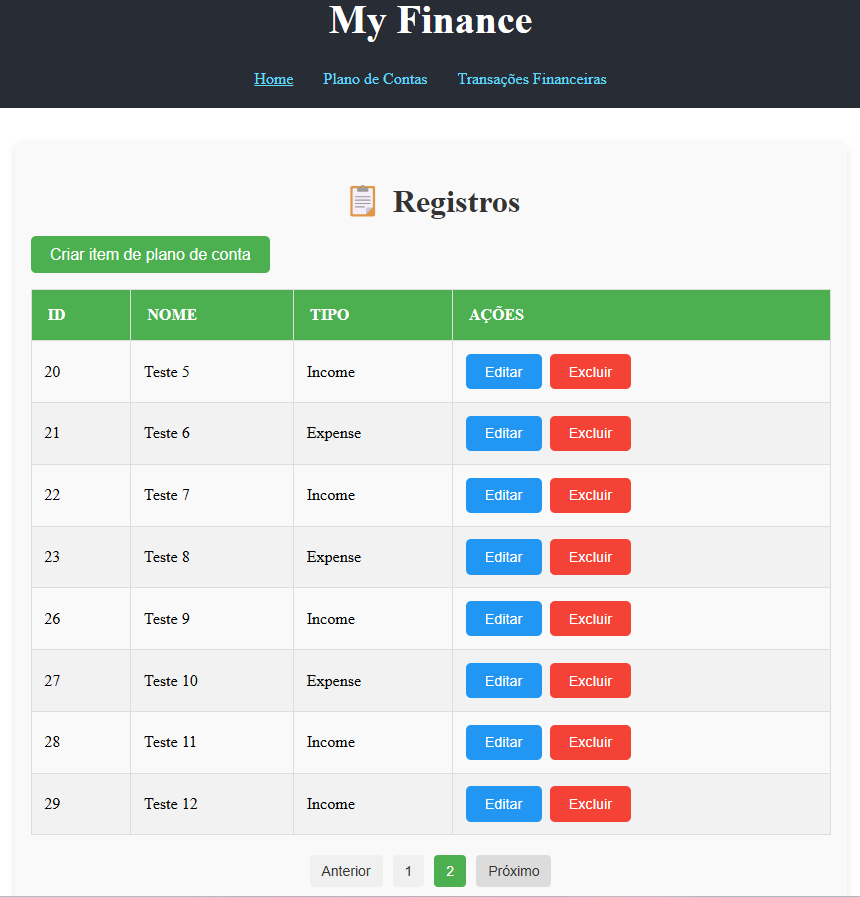
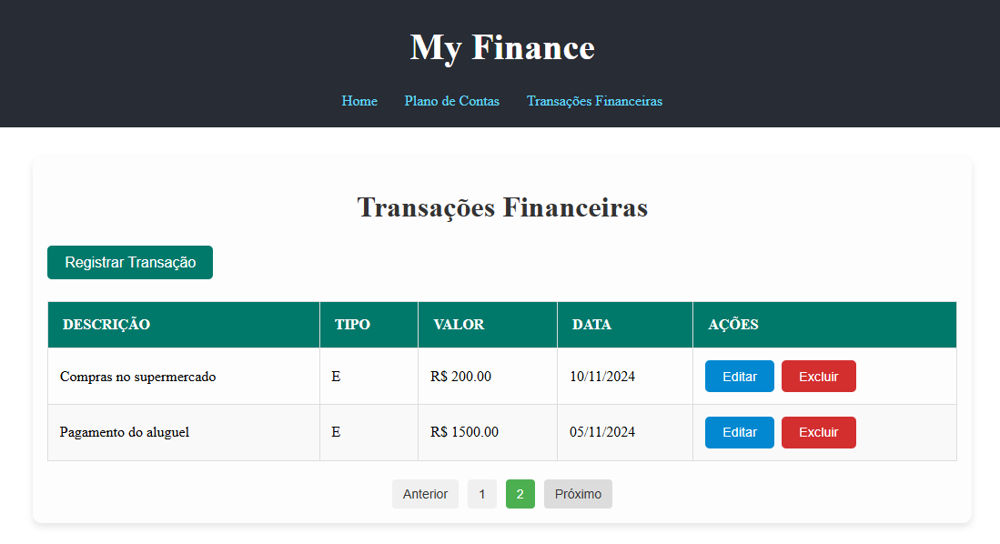
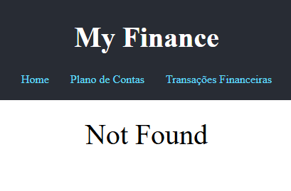
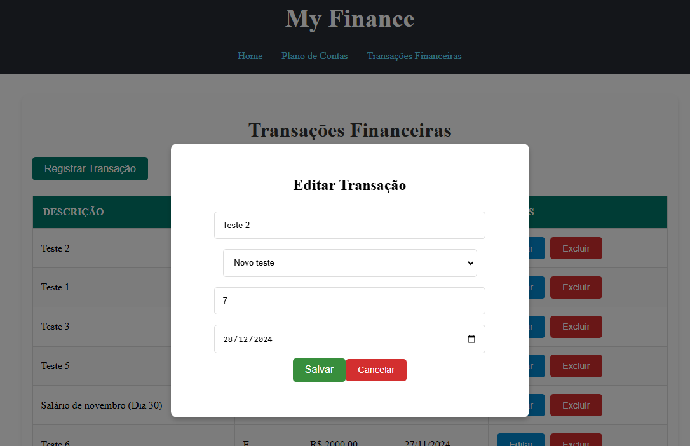

# MyFinance Web React

## Descrição do Projeto

O MyFinance Web React é um projeto frontend desenvolvido para gerenciar planos de contas e transações financeiras. Ele permite que os usuários adicionem, editem e excluam planos de contas e transações financeiras, além de visualizar um resumo financeiro mensal.

## Arquitetura Utilizada

O projeto segue uma arquitetura baseada em componentes utilizando React. A estrutura de diretórios é organizada da seguinte forma:

- `src/`: Contém todo o código-fonte do projeto.
  - `components/`: Componentes reutilizáveis da aplicação.
    - `AccountPlanModal/`: Modal para adicionar/editar planos de contas.
    - `FinancialTransactionsModal/`: Modal para adicionar/editar transações financeiras.
    - `Header/`: Cabeçalho da aplicação.
    - `Modal/`: Componente genérico de modal.
    - `Pagination/`: Componente de paginação.
  - `constants/`: Constantes utilizadas na aplicação.
  - `functions/`: Funções para realizar chamadas à API.
  - `pages/`: Páginas da aplicação.
    - `AccountPlan/`: Página de gerenciamento de planos de contas.
    - `FinancialTransactions/`: Página de gerenciamento de transações financeiras.
    - `Home/`: Página inicial com resumo financeiro.
    - `NotFound/`: Página de erro 404.
  - `assets/`: Recursos estáticos como imagens e ícones.
  - `main.jsx`: Ponto de entrada da aplicação.

## Tecnologias

As principais ferramentas e bibliotecas utilizadas no projeto incluem:

- **Vite**: Gerenciador de build moderno e rápido, que oferece uma experiência de desenvolvimento ágil com hot module replacement (HMR).
- **PropTypes**: Utilizado para validação de tipos nas props dos componentes, garantindo maior consistência e clareza no desenvolvimento.
- **Axios**: Biblioteca para realizar requisições HTTP, simplificando a comunicação com APIs externas.
- **Styled-components**: Abordagem CSS-in-JS para estilização de componentes, permitindo criar estilos dinâmicos e coesos diretamente no código React.
- **ESLint**: Ferramenta de linting que ajuda a manter um código limpo, padronizado e livre de erros comuns.
- **Prettier**: Formatação automática de código para garantir consistência em todo o projeto.

## Configuração para Startup do Projeto

### Pré-requisitos

- Node.js (versão 14 ou superior)
- npm (gerenciador de pacotes do Node.js)

### Passos para Configuração

1. Clone o repositório:
   ```sh
   git clone https://github.com/seu-usuario/myfinance-web-react.git
   cd myfinance-web-react
   ```
2. Instale as dependências:
   ```sh
   npm install
   ```
3. Inicie o servidor de desenvolvimento:
   ```sh
   npm start
   ```
4. Abra o navegador e acesse http://localhost:3000 para visualizar a aplicação.

## Telas e Modais

### Telas

1. **Tela Inicial**

   - Descrição: Página inicial com resumo financeiro mensal.
   - Funcionalidades: Exibe entradas, saídas e economia do mês atual, com navegação para outras páginas.
   - Componente: [`Home`](src/pages/Home/Home.jsx)
   - 

2. **Tela de Plano de Contas**

   - Descrição: Gerenciamento de planos de contas.
   - Funcionalidades: Adicionar, editar e excluir planos de contas, com paginação.
   - Componente: [`AccountPlan`](src/pages/AccountPlan/AccountPlan.jsx)
   - 

3. **Tela de Transações Financeiras**

   - Descrição: Gerenciamento de transações financeiras.
   - Funcionalidades: Adicionar, editar e excluir transações financeiras, com paginação.
   - Componente: [`FinancialTransactions`](src/pages/FinancialTransactions/FinancialTransactions.jsx)
   - 

4. **Tela de Erro 404**
   - Descrição: Página exibida quando a rota não é encontrada.
   - Funcionalidades: Exibe uma mensagem de erro.
   - Componente: [`NotFound`](src/pages/NotFound/NotFound.jsx)
   - 

### Modais

1. **Modal de Plano de Contas**

   - Descrição: Modal para adicionar ou editar planos de contas.
   - Funcionalidades: Formulário para inserir nome e tipo de conta, botões para salvar ou cancelar.
   - Componente: [`AccountPlanModal`](src/components/AccountPlanModal/AccountPlanModal.jsx)
   - 
   - 

2. **Modal de Transações Financeiras**

   - Descrição: Modal para adicionar ou editar transações financeiras.
   - Funcionalidades: Formulário para inserir descrição, plano, valor e data, botões para salvar ou cancelar.
   - Componente: [`FinancialTransactionsModal`](src/components/FinancialTransactionsModal/FinancialTransactionsModal.jsx)
   - 
   - 
